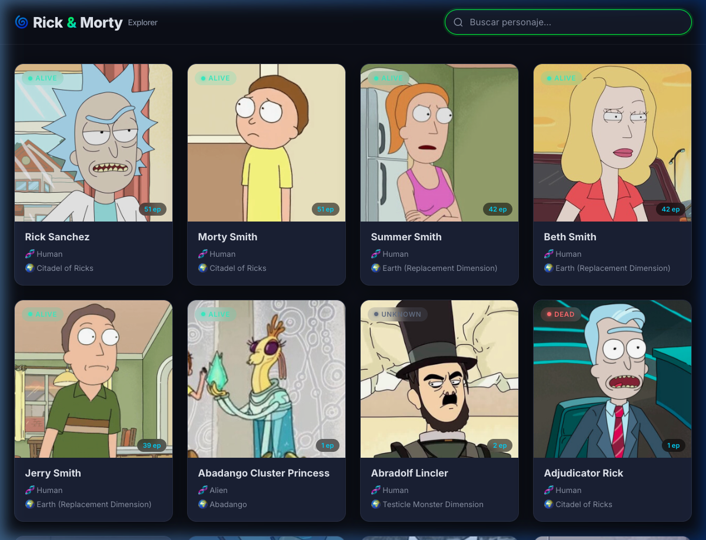
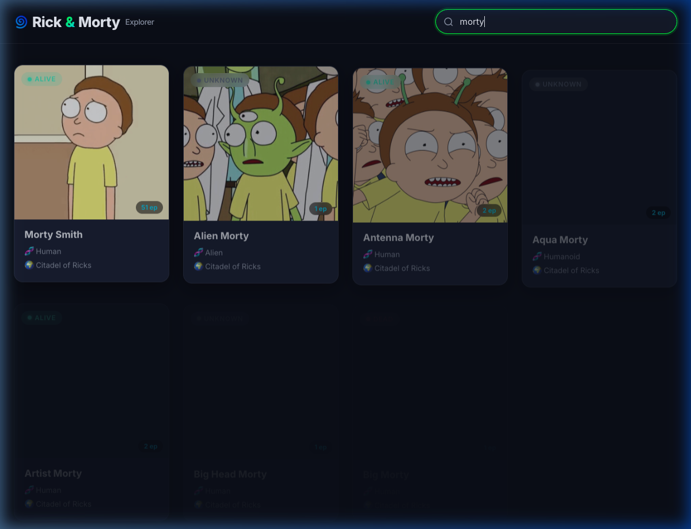
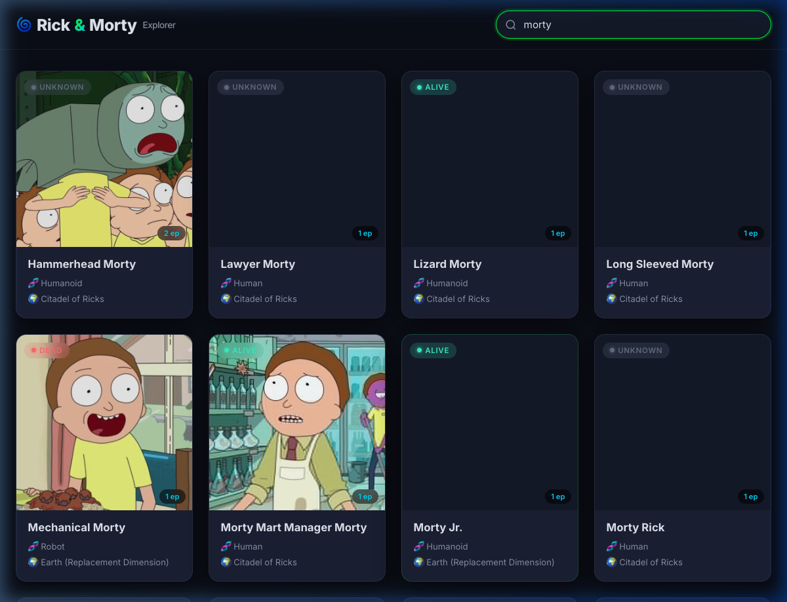

# 🌀 Rick and Morty

Aplicación para explorar los personajes del universo de Rick and Morty.  
Consume la [API pública de Rick and Morty](https://rickandmortyapi.com/) a través de un backend propio con transformación de datos y caché.

| | |
|---|---|
| **Stack** | Python 3 · Flask · HTML5 · CSS3 · JavaScript ES6+ |
| **API Externa** | https://rickandmortyapi.com/ |
| **Versión** | 1.0 |

---

## 📂 Estructura del Proyecto

```
rick-and-morty-app/
├── backend/
│   ├── app.py                  # Punto de entrada Flask
│   ├── routes/
│   │   └── characters.py       # Blueprint — GET /characters
│   ├── services/
│   │   └── rick_api.py         # Consumo de API externa + caché + transformación
│   ├── requirements.txt        # Dependencias Python
│   ├── .env                    # Variables de entorno (no versionado)
│   └── .env.example            # Plantilla de variables (versionado)
├── frontend/
│   ├── index.html              # Estructura HTML semántica
│   ├── styles.css              # Tema oscuro con acentos portal-green
│   └── app.js                  # Lógica: fetch, debounce, paginación, estados
├── screenshots/                # Capturas de la app funcionando
└── README.md
```

---

## 🚀 Cómo Correr el Desarrollo

### Prerrequisitos

- Python 3.10+
- pip
- Un navegador web moderno

### 1. Clonar el repositorio

```bash
git clone <url-del-repo>
cd rick-and-morty-app
```

### 2. Backend

```bash
cd backend
python -m venv venv
source venv/bin/activate       # Windows: venv\Scripts\activate
pip install -r requirements.txt
cp .env.example .env
flask run --port 5001
```

El servidor estará disponible en `http://localhost:5001`.

> **Nota:** Se usa el puerto **5001** en lugar del 5000 porque macOS utiliza el puerto 5000 para AirPlay Receiver.

### 3. Frontend (en otra terminal)

```bash
cd frontend
python -m http.server 3000
```

Abrir **http://localhost:3000** en el navegador.

---

## 📸 Screenshots del Desarrollo Funcionando

### Grid Principal — Página de inicio
Vista inicial con los personajes paginados. Cada tarjeta muestra imagen, nombre, especie, ubicación, estado (Alive/Dead/Unknown) con badge de color, y conteo de episodios.



---

### Búsqueda Filtrada — Buscar "morty"
El input de búsqueda filtra personajes con debounce de 300ms. La petición se envía al backend con `?name=morty`.



---

### Paginación — Página 2 de resultados
Navegación entre páginas con controles Anterior/Siguiente. El indicador muestra la página actual y el total.


---

## 📡 API del Backend

### `GET /characters`

| Parámetro | Tipo | Descripción |
|-----------|------|-------------|
| `name` | string (opcional) | Filtro de búsqueda parcial, insensible a mayúsculas |
| `page` | integer (opcional) | Número de página (default: 1) |

#### Respuesta exitosa (200)

```json
{
  "data": [
    {
      "id": 1,
      "name": "Rick Sanchez",
      "status": "Alive",
      "species": "Human",
      "type": "",
      "gender": "Male",
      "origin": { "name": "Earth (C-137)", "url": "..." },
      "location": { "name": "Citadel of Ricks", "url": "..." },
      "image": "https://rickandmortyapi.com/api/character/avatar/1.jpeg",
      "episode_count": 51,
      "url": "https://rickandmortyapi.com/api/character/1",
      "created": "2017-11-04T18:48:46.250Z"
    }
  ],
  "page": 1,
  "total_pages": 42
}
```

#### Errores

| Código | Escenario | Body |
|--------|-----------|------|
| 404 | No se encontraron personajes | `{"error": "No characters found", "code": 404}` |
| 503 | La API externa no está disponible | `{"error": "External API unavailable", "code": 503}` |


